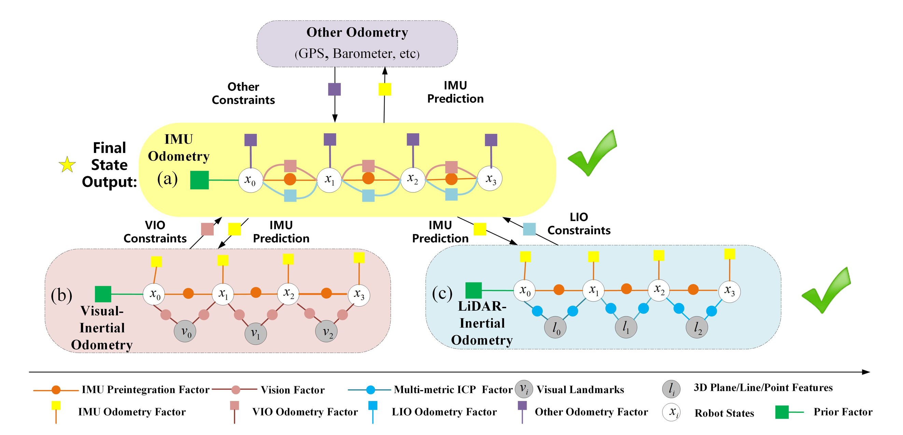
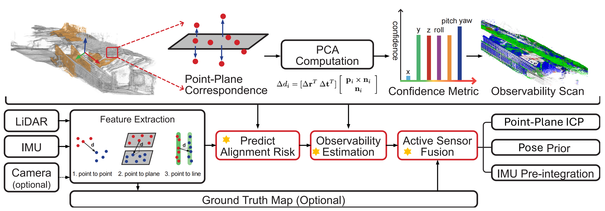

# SuperOdometry: Lightweight LiDAR-inertial Odometry and Mapping

<div align="center">

[](https://superodometry.com/) [](./LICENSE)

</div>

<p align="center">
  
</p>

> 🔥 This is a slim version of Super Odometry, containing only the LiDAR-inertial Odometry component. It fuses LiDAR feature points with IMU data through factor graph optimization to enable robust navigation. The system has been extensively tested across various platforms.

<p align="center">
  
</p>

## 🔥 1. Key Features

- **Multi-LiDAR Support**
  - Compatible with Livox, Velodyne, and Ouster sensors
- **LiDAR-inertial Fusion**
  - Support LiDAR-inertial Fusion 
- **Dual-Mode Operation**
  - Supports both localization and mapping modes
- **Alignment Risk Prediction**
  - Provides alignment risk prediction for ICP algorithms
- **ROS 2.0 Integration**
  - Built on ROS 2 Humble for modern robotics development
- **Degeneracy Awareness**
  - Robust handling of environmental degeneracy

## 2. System Pipeline

<p align="center">
  
</p>

<p align="center">
  
</p>


View our demo results and evaluations at [slam mode](https://superodometry.com) and [localizaiton mode](https://superodometry.com/superloc)


## 📦 3. Installation
> Highly recommend to check our docker files to run our code with step 4 and step 5. 
### System Requirements

- ROS2 Humble
- PCL
- Eigen
- [Livox-SDK2](https://github.com/Livox-SDK/livox_ros_driver2)
- [Sophus](https://github.com/strasdat/Sophus)
- [GTSAM (4.0.2 or 4.1)](https://github.com/borglab/gtsam)
- [Ceres Solver](http://ceres-solver.org/)
- [ROS2-jsk-plugin](https://github.com/teamspatzenhirn/rviz_2d_overlay_plugins)

### Dependencies Installation

#### Install Sophus
```bash
git clone http://github.com/strasdat/Sophus.git
cd Sophus && git checkout 97e7161
mkdir build && cd build
cmake .. -DBUILD_TESTS=OFF
make -j8 && sudo make install
```

#### Install GTSAM
```bash
git clone https://github.com/borglab/gtsam.git
cd gtsam && git checkout 4abef92
mkdir build && cd build
cmake \
  -DGTSAM_USE_SYSTEM_EIGEN=ON \
  -DGTSAM_BUILD_WITH_MARCH_NATIVE=OFF \
  ..
make -j6 && sudo make install
```

#### Install Ceres
```bash
sudo apt-get install -y libceres-dev
```

## 🐳 4. Docker Setup

### Prerequisites
- [Docker](https://www.docker.com/)
- [NVIDIA Docker](https://docs.nvidia.com/datacenter/cloud-native/container-toolkit/install-guide.html)

### Building Docker Image
```bash
cd docker
docker build -t superodom-ros2:latest .
```

### Workspace Structure

Ensure the following structure within `ros_ws/src`:

```
ros_ws/src
├── super_odometry
├── livox_ros_driver2
└── rviz_2d_overlay_plugins
```

> **Important**: Maintain this exact structure within `ros_ws/src`

### Building the Workspace
```bash
cd livox_ros_driver2
./build.sh humble 
cd ~/ros_ws
colcon build
```

## 🚀 5. Quick Start

### Container Setup
```bash
# Allow Docker GUI access
xhost +local:docker

# Make container script executable
sudo chmod -R 777 container_run.sh

# Start container
./container_run.sh superodom-ros2 superodom-ros2:latest

# Access container
docker exec --privileged -it superodom-ros2 /bin/bash

# Source ROS2
source /opt/ros/humble/setup.bash
```

### Launch Super Odometry
```bash
cd script
tmuxp load run.yaml
```

## 📍 Localization Mode Configuration

Update your `.yaml` configuration file with:
```yaml
localization_mode: true         # If true, localization mode is enabled; otherwise, SLAM mode is used
read_pose_file: false    # Set to true to read initial pose from a txt file
init_x: 0.0        # Initial X position for localization
init_y: 0.0         # Initial Y position for localization
init_z: 0.0         # Initial Z position for localization
init_roll: 0.0           # Initial roll angle
init_pitch: 0.0          # Initial pitch angle
init_yaw: 0.0      # Initial yaw angle
```


## 📍 6. Dataset 

Feel free to run our code on our dataset with [slam_mode](https://superodometry.com/iccv23_challenge_LiI) and [localization_mode](https://superodometry.com/superloc). 


## 📫 7. Contact

- [Open an Issue](https://github.com/YourUsername/SuperOdometry)
- [Visit our Website](https://superodometry.com/contact)

## 📚 8. Citations

```bibtex
@inproceedings{zhao2021super,
  title={Super odometry: IMU-centric LiDAR-visual-inertial estimator for challenging environments},
  author={Zhao, Shibo and Zhang, Hengrui and Wang, Peng and Nogueira, Lucas and Scherer, Sebastian},
  booktitle={2021 IEEE/RSJ International Conference on Intelligent Robots and Systems (IROS)},
  pages={8729--8736},
  year={2021},
  organization={IEEE}
}

@inproceedings{zhao2025superloc,
  title={SuperLoc: The Key to Robust LiDAR-Inertial Localization Lies in Predicting Alignment Risks},
  author={Zhao, Shibo and Zhu, Honghao and Gao, Yuanjun and Kim, Beomsoo and Qiu, Yuheng and Johnson, Aaron M. and Scherer, Sebastian},
  booktitle={2025 IEEE International Conference on Robotics and Automation (ICRA)},
  year={2025},
  url={https://arxiv.org/abs/2412.02901}
}
```

## 9. Next Plan
🔵 Colorized Point Cloud Visualization — [Video Demo](https://www.youtube.com/watch?v=r7nLDGrz4gE)

🟢 Visual Odometry Module — Initial Release
Lightweight and robust visual odometry module integrated into SuperOdometry.


## 📝 10. License

This package is released under the GPLv3 license. For commercial use, please contact shiboz@andrew.cmu.edu and Prof. Sebastian Scherer.

## 🙏 11. Acknowledgements

Special thanks to Professor Ji Zhang and Professor Michael Kaess for their valuable advice. We also acknowledge these foundational works:

- LOAM: Lidar Odometry and Mapping in Real-time (RSS 2014)
- GTSAM: Georgia Tech Smoothing and Mapping Library
- [FastLIO](https://github.com/hku-mars/FAST_LIO),  [LIOSAM](https://github.com/TixiaoShan/LIO-SAM)
