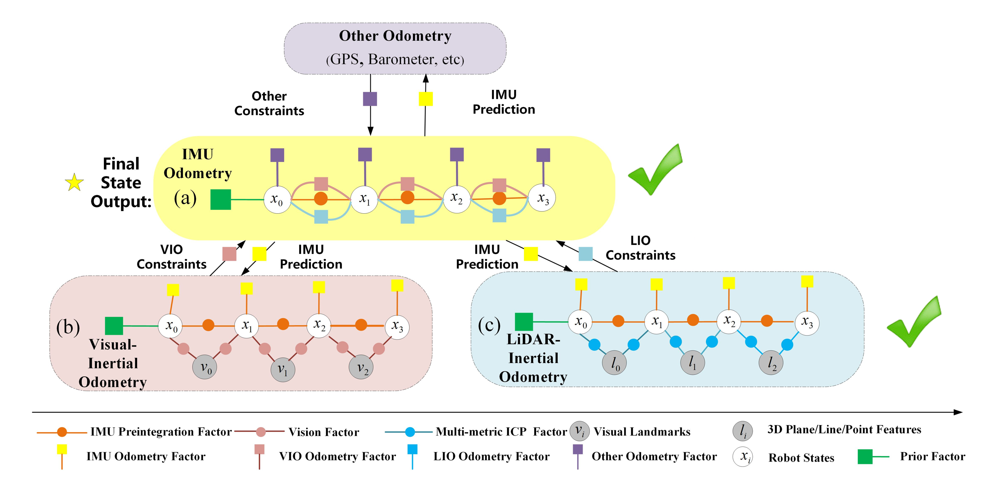
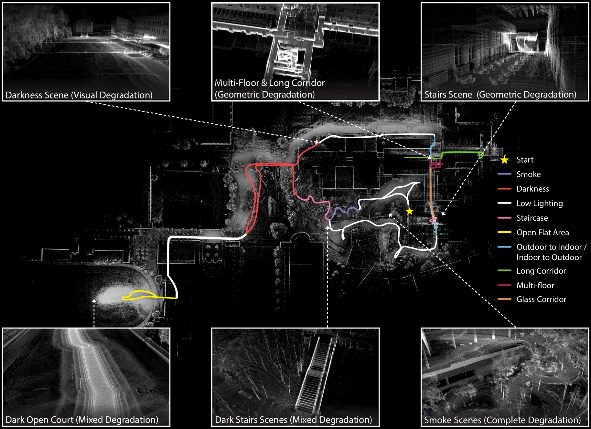

# SuperOdometry: Lightweight LiDAR-inertial Odometry and Mapping

<div align="center">

[](https://superodometry.com/) [](./LICENSE)

</div>

<p align="center">
  
</p>

> 🔥 This is a slim version of Super Odometry, containing the LiDAR Odometry component and IMU Odometry component. The LiDAR odometry only provides pose constraints to IMU odometry modules to estimate the bias of IMU. In return, the IMU Odometry module offers pose predictions to the LiDAR Odometry module, serving as an initial guess for ICP optimization.
<p align="center">
  
</p>

> 🔥 The system has been widely tested on above platforms equipped with Livox, Velodyne and Ouster LiDAR. 


## 📋 Table of Contents

0. [Common building Issues](solution.md)
1. [Introduction](#superodometry-lightweight-lidar-inertial-odometry-and-mapping)
2. [🔥 Key Features](#-1-key-features)
3. [📦 Installation](#-3-installation)
   - [System Requirements](#system-requirements)
   - [Dependencies Installation](#dependencies-installation)
4. [🐳 Docker Setup](#-4-docker-setup)
   - [Prerequisites](#prerequisites)
   - [Building Docker Image](#building-docker-image)
   - [Workspace Structure](#workspace-structure)
   - [Docker Container Setup](#docker-container-setup)
5. [🚀 Launch SuperOdometry](#-5-launch-superodometry)
   - [Dataset Setup](#dataset-setup)
   - [Configuration](#configuration)
   - [Launch Commands](#launch-commands)
   - [Visualization (RVIZ2 & Rerun)](#visualization-rviz2--rerun)
6. [📍 Localization Mode Configuration](#-localization-mode-configuration)
7. [📚 Citations](#-8-citations)
8. [🛠️ Next Plan](#9-next-plan)
9. [📝 License](#-10-license)
10. [🙏 Acknowledgements](#-11-acknowledgements)


## 🔥 1. Key Features

- **Multi-LiDAR Support**
  - Compatible with Livox, Velodyne, and Ouster sensors
- **LiDAR-inertial Fusion**
  - Support LiDAR-inertial Fusion 
- **Dual-Mode Operation**
  - Supports both localization and mapping modes
- **Alignment Risk Prediction**
  - Provides alignment risk prediction for ICP algorithms
- **Degeneracy Awareness**
  - Robust detection of environmental degeneracy
- **ROS 2.0 Integration**
  - Built on ROS 2 Humble for modern robotics development

<p align="center">
  
</p>

<p align="center">
  
</p>

> 🔥 6 DOF degeneracy uncertainty detection. We support visualization in both RVIZ and Rerun. 

## 📦 3. Installation without docker
> Highly recommend to check our docker files to run our code with step 4 and step 5. 
### System Requirements for Installation on Host machine.

- ROS2 Humble
- PCL
- Eigen
- [Sophus](https://github.com/strasdat/Sophus)
- [GTSAM (4.0.2 or 4.1)](https://github.com/borglab/gtsam)
- [Ceres Solver (2.1.0)](http://ceres-solver.org/)

### Workspace Structure

First create your own local ROS2 workspace and clone `SuperOdom`: 
```bash
mkdir -p ~/superodom_ws/src
cd ~/superodom_ws/src
git clone https://github.com/superxslam/SuperOdom
```
Clone respective repos and ensure they follow this exact structure under `superodom_ws/src`:

```
superodom_ws/src
├── SuperOdom
├── livox_ros_driver2

``` 

 **Important**: Maintain this exact structure within `superodom_ws/src`
### Dependencies Installation

We provide a bash script which will setup the project on your host system.
> if you plan to use docker, you don't need to run follwing steps and directly check next section`

`SuperOdom`: 
```bash
mkdir -p ~/superodom_ws/src
cd ~/superodom_ws/src
git clone https://github.com/superxslam/SuperOdom
git checkout dev/humanoid_mid360
cd SuperOdom
sudo chmod +x install_dependency.sh && ./install_dependency.sh
cd livox_ros_driver2 
source /opt/ros/humble/install/setup.sh
bash build.sh humble
```

> **Note**: To launch SuperOdometry, check `script/humanoid.yaml` for detailed launch instructions.

<details>
<summary><h2>🐳 4. Installation with docker</h2></summary>

### Prerequisites
- [Docker](https://www.docker.com/)
- [NVIDIA Docker](https://docs.nvidia.com/datacenter/cloud-native/container-toolkit/install-guide.html)

### Building Docker Image
```bash
cd ros2_humble_docker
docker build -t superodom-ros2:latest .
```

### Workspace Structure

First create your own local ROS2 workspace and clone `SuperOdom`: 
```bash
mkdir -p ~/superodom_ws/src
cd ~/superodom_ws/src
git clone https://github.com/superxslam/SuperOdom
```
Clone respective repos and ensure they follow this exact structure under `superodom_ws/src`:
```
superodom_ws/src
├── SuperOdom
├── livox_ros_driver2
├──rviz_2d_overlay_plugins (optional)
```
You can clone `livox_ros_driver2` and `rviz_2d_overlay_plugins (optional)` using the following link:

- [Livox-ROS-driver2](https://github.com/Livox-SDK/livox_ros_driver2)
- [ROS2-jsk-plugin](https://github.com/teamspatzenhirn/rviz_2d_overlay_plugins)

> **Important**: Maintain this exact structure within `superodom_ws/src`

### Docker Container Setup
```bash
# Allow Docker GUI access
xhost +local:docker
```

Go to `ros2_humble_docker/container_run.sh` and make sure you change exact directory path for `PROJECT_DIR` and `DATASET_DIR`
to mount these directory to docker
```bash
PROJECT_DIR="/path/to/your/superodom"   
DATASET_DIR="/path/to/your/dataset"
```
> **Important**: `PROJECT_DIR` should be the exact directory to `superodom_ws/src`

Then launch docker container using the following:
```bash
# Grant access
cd ros2_humble_docker
sudo chmod -R 777 container_run.sh

# Start container
./container_run.sh superodom-ros2 superodom-ros2:latest


```
> **Important**: To access container, you can open a new bash window and run `docker exec --privileged -it superodom-ros2 /bin/bash` 

Build the workspace within container
```bash
pip install empy==3.3.4
sudo apt-get install -y python3-ament-package python-tk python3-pip
sudo apt-get -y install python3-rosdep python3-rosinstall python3-rosinstall-generator python3-wstool build-essential
cd ~/superodom_ws/src/livox_ros_driver2
./build.sh humble 
cd ~/superodom_ws
colcon build 
```
> **Important**: make sure you first build `livox_ros_driver2` 

### Launch the SLAM for humanoid robots

To launch SuperOdometry, check `script/humanoid.yaml` for detailed launch instructions and configuration.

```bash
cd script
tmuxp load humanoid.yaml
```

> **Note**: Make sure to modify the paths in `script/humanoid.yaml` (SUPERODOM_WS, DATASET_DIR, BAG_LIVOX, BAG_OTHER) before running.

</details>

<details>
<summary><h2>🚀 5. Launch SuperOdometry</h2></summary>

To launch SuperOdometry, please check `script/humanoid.yaml` for detailed launch instructions. The YAML file contains all the necessary configuration and commands to launch the system.

**Quick Start:**
```bash
cd script
tmuxp load humanoid.yaml
```

> **Note**: Make sure to modify the paths in `script/humanoid.yaml` (SUPERODOM_WS, DATASET_DIR, BAG_LIVOX, BAG_OTHER) before running.

For demo datasets and additional resources:
- Demo datasets for Livox-mid360, VLP-16 and OS1-128 sensor: [Download Link](https://drive.google.com/drive/folders/1oA0kRFIH0_8oyD32IW1vZitfxYunzdBr?usp=sharing)
- More challenge datasets: [slam_mode](https://superodometry.com/iccv23_challenge_LiI) and [localization_mode](https://superodometry.com/superloc)
- Convert ROS1 bag to ROS2 format: [Tutorial](https://docs.openvins.com/dev-ros1-to-ros2.html)

For configuration:
- Topic names: modify `super_odometry/config/$(YOUR_LiDAR_SENSOR).yaml`
- Laser-IMU extrinsics: modify `super_odometry/config/$(YOUR_LiDAR_SENSOR)/$(YOUR_LiDAR_SENSOR)_calibration.yaml`

</details>

<details>
<summary><h2>📍 6. Localization Mode Configuration</h2></summary>

https://github.com/user-attachments/assets/42cb5480-c283-4608-84be-ff12a05d09e0

> 🔥 The localization mode allows you to localize your robot by providing an initial pose and ground truth map. 

Update your `super_odometry/config/$(YOUR_LiDAR_SENSOR).yaml` configuration file with:
```yaml
localization_mode: true         # If true, localization mode is enabled; otherwise, SLAM mode is used
read_pose_file: false           # Set to true to read initial pose from a txt file
init_x: 0.0                     # Initial X position for localization
init_y: 0.0                     # Initial Y position for localization
init_z: 0.0                     # Initial Z position for localization
init_roll: 0.0                  # Initial roll angle
init_pitch: 0.0                 # Initial pitch angle
init_yaw: 0.0                   # Initial yaw angle
```

Add ground truth map map in launch file
```yaml
parameters=[LaunchConfiguration("config_file"),
    { "calibration_file": LaunchConfiguration("calibration_file"),
     "map_dir": os.path.join(home_directory, "/path/to/your/pcd"),
}]
```
To quickly launch our localization module, feel free to try out this demo [dataset](https://drive.google.com/drive/folders/1WOTj4j9t5LkKkdajFlj6bZcdmPcsJipz?usp=sharing) using default initial pose configuration.

</details> 

<!-- ## 📫 7. Contact

- [Open an Issue](https://github.com/YourUsername/SuperOdometry)
- [Visit our Website](https://superodometry.com/contact) -->

## 📚 8. Citations

```bibtex
@inproceedings{zhao2021super,
  title={Super odometry: IMU-centric LiDAR-visual-inertial estimator for challenging environments},
  author={Zhao, Shibo and Zhang, Hengrui and Wang, Peng and Nogueira, Lucas and Scherer, Sebastian},
  booktitle={2021 IEEE/RSJ International Conference on Intelligent Robots and Systems (IROS)},
  pages={8729--8736},
  year={2021},
  organization={IEEE}
}

@inproceedings{zhao2025superloc,
  title={SuperLoc: The Key to Robust LiDAR-Inertial Localization Lies in Predicting Alignment Risks},
  author={Zhao, Shibo and Zhu, Honghao and Gao, Yuanjun and Kim, Beomsoo and Qiu, Yuheng and Johnson, Aaron M. and Scherer, Sebastian},
  booktitle={2025 IEEE International Conference on Robotics and Automation (ICRA)},
  year={2025},
  url={https://arxiv.org/abs/2412.02901}
}
```

## 9. Next Planrgb
🔵 Colorized Point Cloud Visualization — [Video Demo](https://www.youtube.com/watch?v=r7nLDGrz4gE)

🟢 Visual Odometry Module — Initial Release
Lightweight and robust visual odometry module integrated into SuperOdometry.


## 📝 10. License

This package is released under the GPLv3 license. For commercial use, please contact shiboz@andrew.cmu.edu and Prof. Sebastian Scherer.

## 🙏 11. Acknowledgements

Special thanks to Professor Ji Zhang, Professor Michael Kaess, Parv Maheshwari, Yuanjun Gao, Yaoyu Hu for their valuable advice. Thanks to Omar Alama for providing Rerun support. We also acknowledge these foundational works:

- LOAM: Lidar Odometry and Mapping in Real-time (RSS 2014)
- GTSAM: Georgia Tech Smoothing and Mapping Library
- [FastLIO](https://github.com/hku-mars/FAST_LIO),  [LIOSAM](https://github.com/TixiaoShan/LIO-SAM)
